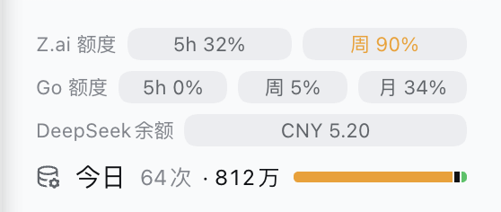
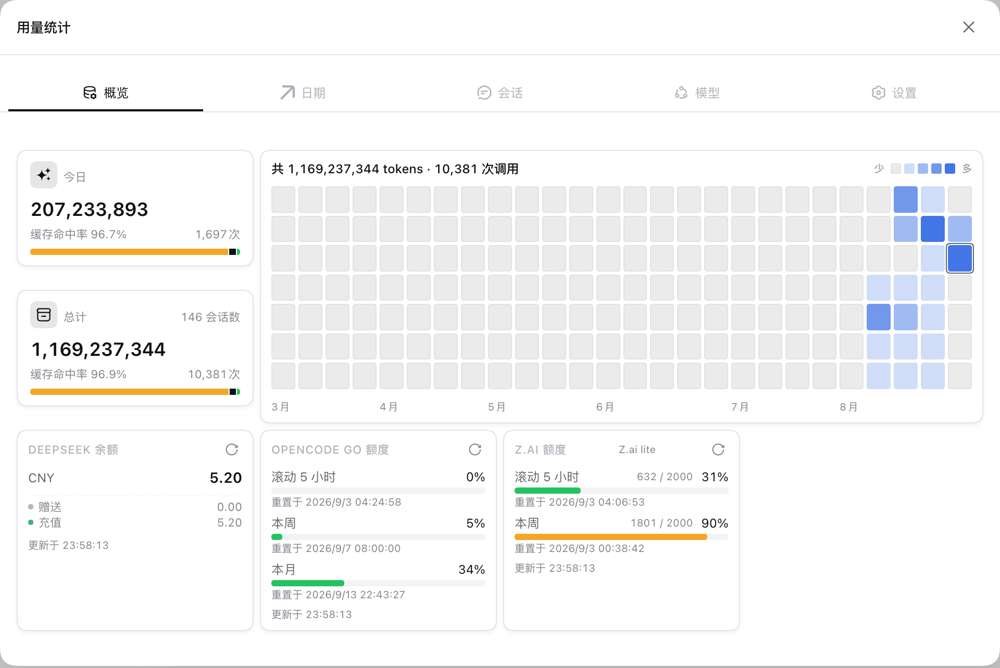
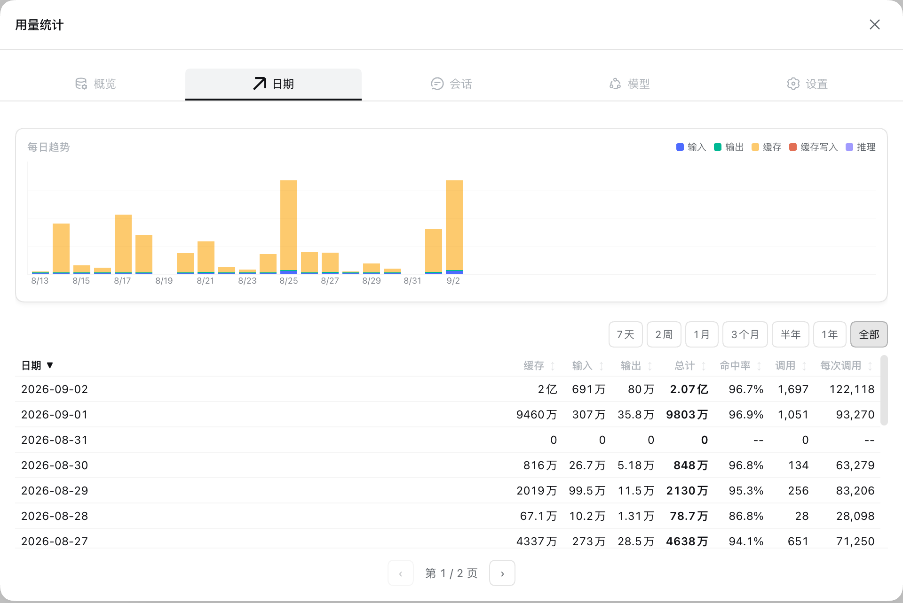
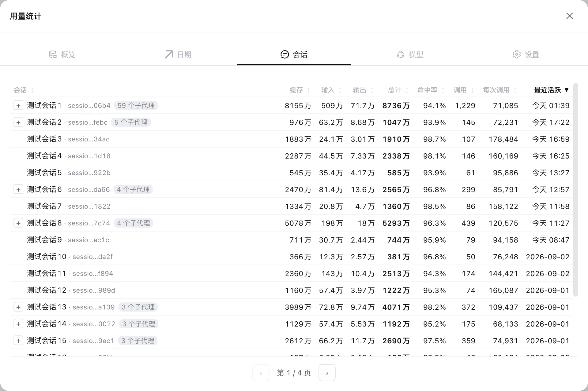
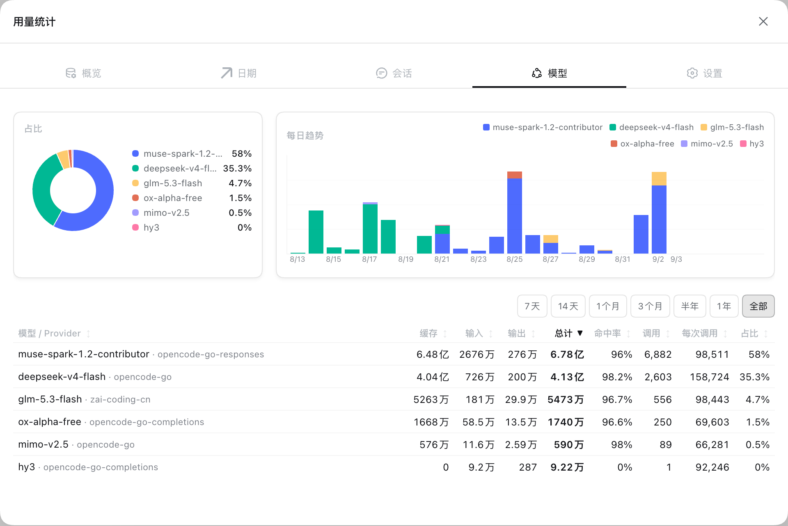
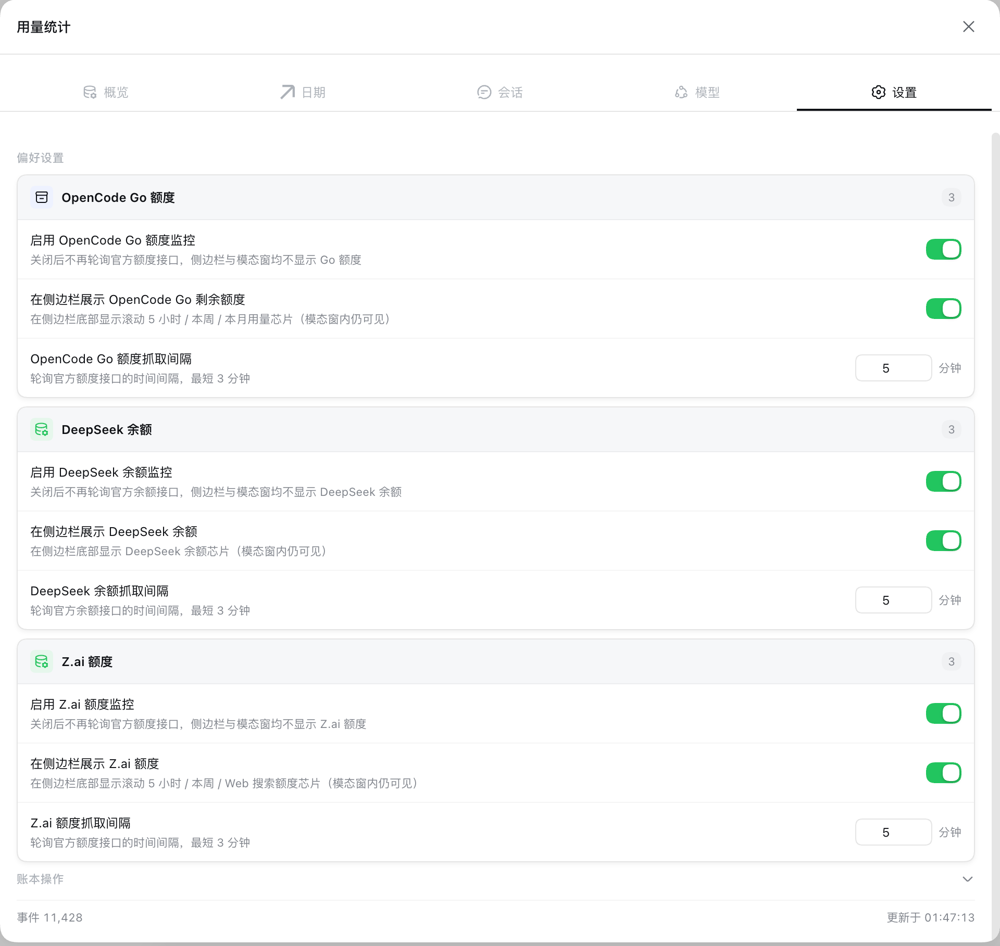

# dsh-usage-stats — DSH 用量统计插件

DSH 的 Web 用量统计插件，按模型、会话、日期三个维度统计 token 用量与调用次数，挂载于侧边栏底部。底部展示今日用量，点击打开详情面板。

## 功能

- 侧边栏底部今日统计，宽列与 56px rail 自适应展示
- 详情面板按概览、日期、会话、模型、设置组织
- OpenCode Go 额度，展示滚动 5 小时、本周、本月三档剩余额度
- DeepSeek 余额，展示多币种余额
- Z.ai 额度，展示滚动 5 小时与本周百分比

<p align="center">
  
  <br>
  <em>侧边栏底部</em>
</p>

<table>
  <tr>
    <td align="center" width="50%">
      
      <br>
      <sub>概览</sub>
    </td>
    <td align="center" width="50%">
      
      <br>
      <sub>日期</sub>
    </td>
  </tr>
  <tr>
    <td align="center" width="50%">
      
      <br>
      <sub>会话</sub>
    </td>
    <td align="center" width="50%">
      
      <br>
      <sub>模型</sub>
    </td>
  </tr>
  <tr>
    <td align="center" colspan="2" width="50%">
      
      <br>
      <sub>设置</sub>
    </td>
  </tr>
</table>

## 安装与卸载

本插件为标准 cordis 组合包，通过 profile 注入 web。

### 从 npm 安装

```bash
dsh plugin --profile web add @xfqz86/dsh-usage-stats
```

### 从 GitHub 安装

```bash
dsh plugin --profile web add github:xfqz86/dsh-usage-stats#release
```

### 从 tarball 安装

```bash
dsh plugin --profile web add https://github.com/xfqz86/dsh-usage-stats/releases/latest/download/xfqz86-dsh-usage-stats.tgz
```

> 固定地址，始终指向最新 Release 的 tarball；也可在 [Releases](https://github.com/xfqz86/dsh-usage-stats/releases) 复制指定版本的 `xfqz86-dsh-usage-stats-*.tgz` 链接。

### 本地开发

```bash
git clone https://github.com/xfqz86/dsh-usage-stats.git
cd dsh-usage-stats
pnpm install
pnpm build
dsh plugin --profile web add "link:$(pwd)"
# 后续改动后重新 pnpm build，浏览器刷新即可；服务端改动需重启 dsh
```

### 卸载

```bash
dsh plugin --profile web remove @xfqz86/dsh-usage-stats
```

## 设置

设置位于详情面板的设置 Tab，持久化于浏览器本地存储。

- 启用 OpenCode Go 额度监控，关闭后停止轮询，侧边栏与面板均不展示
- 在侧边栏展示 OpenCode Go 剩余额度，仅控制芯片，面板内详情仍可见
- OpenCode Go 抓取间隔，默认 5 分钟，下限 3 分钟
- 启用 DeepSeek 余额监控与侧边栏展示，逻辑同上
- 启用 Z.ai 额度监控与侧边栏展示，逻辑同上
- 各额度抓取间隔均为默认 5 分钟，下限 3 分钟

需展示额度时，在 DSH 凭据中心配置对应 Key：

- OpenCode Go：`OPENCODE_GO_API_KEY`
- DeepSeek：`DEEPSEEK_API_KEY`
- Z.ai：`ZAI_API_KEY` 或 `ZAI_CODING_CN_API_KEY`

## 统计口径

- 数据源为 `assistant/message` 事件中携带 `data.usage` 的记录
- `total = input + output + cacheRead + cacheWrite`，`reasoning` 单列
- 按模型维度取 `provider` 与 `model`，缺失记为 `unknown`
- 按会话维度记录标题、工作目录、创建与最近活跃时间
- 按本地自然日划分日期

## 数据存储

账本位于 `$DSH_HOME/storages/dsh-usage-stats/ledger.sqlite`，SQLite 存储。首次启动自动扫描历史会话并导入，后续随事件实时增量更新，重启后可从账本恢复。

## 开发者

- 工程规范与架构说明见 `AGENTS.md`
- 接口协议见 `docs/API.md`
- 模块结构见 `docs/STRUCTURE.md`，由 `pnpm tree` 生成
- 发布流程见 `docs/PUBLISH.md`

## License

MIT
